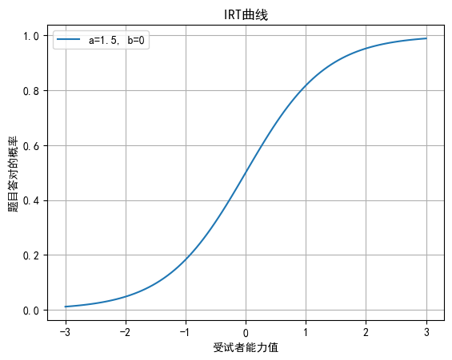

# 简介

- IRT模型为项目反映理论，是心理统计学模型的总称，用于分析考试成绩与问卷调查数据，目的是用于确定**潜在特征**（latent trait）是否可以被测试题目反映出来/**测试题与被测试者**之间的互动关系
- 图像
  - 

# 内容

## 3参数Normal-ogive模型

- 为Lord提出的模型，简称为3PN，公式如下
  - $P(\theta)=c+(1-c)\int_{-\infty}^{a(\theta-b)}\frac{e^{-t^2}}2\sqrt{2\pi}dt$

## 3参数Logistic 模型

- 实际应用中大家一般不会采取Normal-ogive模型，一般会采取3参数的Logistic模型，也为3-parameter Logistic model，模型表达式如下所示
  - $P(\theta)=c+\frac{(1-c)}{1+e^{-Da(\theta-b)}}$
  - D一般为常数1.7

## 参数介绍

- | 参数     | 内容                                                         |
  | -------- | ------------------------------------------------------------ |
  | c        | 猜测参数/为猜测参数，即为当一个测试者能力非常低的时候，仍可能答对这个题目的概率即为c |
  | b        | 项目难度参数/项目难度（item difficulty）                     |
  | 1        | 却分度参数/项目区分度，为ICC曲线拐点最大值，微小改动会影响P值改变 |
  | P        | 回答正确率                                                   |
  | $\theta$ | 被测试者能力                                                 |

## 项目特征曲线/ICC

- 根据上述$p(\theta)$绘制的曲线称为项目特征曲线(Item characteristic curve, ICC)，该曲线描述了成功解答某一题目的可能性与被测试者能力的关系，该曲线包含的参数如上所示，为a，b，c，横坐标为$\theta$， 纵坐标为$P(\theta)$
- 变化趋势
  - 当c【猜测参数】趋近于负无穷，即为当一个测试者能力非常低的时候，仍可能答对这个题目的概率即为c【即为随便猜的概率】
  - b【项目难度】对应ICC曲线最陡的一点对应的$\theta$数值，对于下限为0的ICC曲线来说，b值对应的是概率为0.5的测试者能力值
    - 改变b会导致ICC左右移动，不改变形状
    - b值增加，ICC曲线向右移动
    - b值减少，ICC曲线向左移动
  - a【区分度参数】a/4的数值是ICC曲线拐点的斜率/斜率最大值，能力值的改变会造成P值的变动

## Rasch模型

- 公式
  - $P(\theta)=\frac{e^{(\theta-b)}}{1+e^{(\theta-b)}}$
- Rasch模型目前被广泛学者认为是3PN的特例，即为会将**参数c和a都为0**的情况。目前有学者认为测量的定义，模型成立的时候，$\theta$和b分别为回答正确的题目和特点题目的正确率的**充分统计量**
- 重点为运用数据配型模型【只考虑了题目难度】

# 代码

## 待办

- 掌握IRT模型的输入和输出
- 整理IRT的模型以及代码

# 参考

- [wikipedia IRT介绍](https://zh.wikipedia.org/wiki/%E9%A1%B9%E7%9B%AE%E5%8F%8D%E5%BA%94%E7%90%86%E8%AE%BA)
- [项目反应理论(IRT)详解](https://zhuanlan.zhihu.com/p/367628823)
- [PYPI py-irt](https://pypi.org/project/py-irt/)