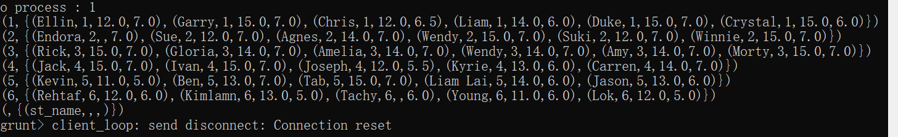

<!-- START doctoc generated TOC please keep comment here to allow auto update -->
<!-- DON'T EDIT THIS SECTION, INSTEAD RE-RUN doctoc TO UPDATE -->


- [云计算概论Pig笔记](#%E4%BA%91%E8%AE%A1%E7%AE%97%E6%A6%82%E8%AE%BApig%E7%AC%94%E8%AE%B0)
  - [Pig命令](#pig%E5%91%BD%E4%BB%A4)
    - [case  when then 命令（条件分支语句）](#case--when-then-%E5%91%BD%E4%BB%A4%E6%9D%A1%E4%BB%B6%E5%88%86%E6%94%AF%E8%AF%AD%E5%8F%A5)
    - [sum命令，求取每列的均值](#sum%E5%91%BD%E4%BB%A4%E6%B1%82%E5%8F%96%E6%AF%8F%E5%88%97%E7%9A%84%E5%9D%87%E5%80%BC)
    - [AVG()命令,求取某一列的平均值](#avg%E5%91%BD%E4%BB%A4%E6%B1%82%E5%8F%96%E6%9F%90%E4%B8%80%E5%88%97%E7%9A%84%E5%B9%B3%E5%9D%87%E5%80%BC)
    - [类型强制转换](#%E7%B1%BB%E5%9E%8B%E5%BC%BA%E5%88%B6%E8%BD%AC%E6%8D%A2)
    - [LIMIT TABLE 5命令，获取前N行输出](#limit-table-5%E5%91%BD%E4%BB%A4%E8%8E%B7%E5%8F%96%E5%89%8Dn%E8%A1%8C%E8%BE%93%E5%87%BA)
    - [flatten 命令和tokenize命令](#flatten-%E5%91%BD%E4%BB%A4%E5%92%8Ctokenize%E5%91%BD%E4%BB%A4)
    - [replace替换命令](#replace%E6%9B%BF%E6%8D%A2%E5%91%BD%E4%BB%A4)
    - [order排序命令](#order%E6%8E%92%E5%BA%8F%E5%91%BD%E4%BB%A4)
    - [Pig Script](#pig-script)
      - [在linux下创建student.pig文件](#%E5%9C%A8linux%E4%B8%8B%E5%88%9B%E5%BB%BAstudentpig%E6%96%87%E4%BB%B6)
      - [在Pig下执行pig脚本](#%E5%9C%A8pig%E4%B8%8B%E6%89%A7%E8%A1%8Cpig%E8%84%9A%E6%9C%AC)
    - [设置并行度](#%E8%AE%BE%E7%BD%AE%E5%B9%B6%E8%A1%8C%E5%BA%A6)
    - [设置Macro函数](#%E8%AE%BE%E7%BD%AEmacro%E5%87%BD%E6%95%B0)
    - [describe 描述表格信息](#describe-%E6%8F%8F%E8%BF%B0%E8%A1%A8%E6%A0%BC%E4%BF%A1%E6%81%AF)
    - [EXPLAIN 命令生成执行信息](#explain-%E5%91%BD%E4%BB%A4%E7%94%9F%E6%88%90%E6%89%A7%E8%A1%8C%E4%BF%A1%E6%81%AF)
    - [ILLUSTRATE命令说明表格信息流来源](#illustrate%E5%91%BD%E4%BB%A4%E8%AF%B4%E6%98%8E%E8%A1%A8%E6%A0%BC%E4%BF%A1%E6%81%AF%E6%B5%81%E6%9D%A5%E6%BA%90)
    - [JOIN命令，连接表格](#join%E5%91%BD%E4%BB%A4%E8%BF%9E%E6%8E%A5%E8%A1%A8%E6%A0%BC)

<!-- END doctoc generated TOC please keep comment here to allow auto update -->

[toc]

# 云计算概论Pig笔记

## Pig命令


### case  when then 命令（条件分支语句）

功能为多增加一行代码，而且必须为''，否则会报错

```
X = FOREACH A GENERATE $0（第一列）, (
	CASE 
		WHEN $2 > 12 THEN 'Very Good'
		WHEN $2 < 12 THEN 'Good'
	END
);
```

### sum命令，求取每列的均值

可以通过table_name.column_name来取值，获取某一列的总值，B为group之后的数值，即为每一列都为一个集合，具体如下图所示。

A.quiz1的原因：是因为B是由A来的，所以B里面的数据是A中数据，而且B中无列



```
C = foreach B generate group(column_name), sum(A.quiz1)
```

### AVG()命令,求取某一列的平均值

```
B = GROUP A BY group;
D = FOREACH B GENERATE group, AVG(A.quiz1);
```

### 类型强制转换

具体强制转化代码为(float)quiz1 + (float)quiz2。

```
A = LOAD 'students.csv' USING PigStorage(',') AS (name:chararray,
group:int, quiz1:float, quiz2:float);
B = FOREACH A GENERATE name, (float)quiz1 + (float)quiz2;
```

### LIMIT TABLE 5命令，获取前N行输出

```
A = LOAD 'students.csv' USING PigStorage(',') AS (name:chararray,
group:int, quiz1:float, quiz2:float);
B = GROUP A BY name;
C = LIMIT B 5;
```

### flatten 命令和tokenize命令

- flatten 命令

  主要是用于提取（）里面的每一个元素作为一条记录。
  
  对分组数据进行提取的时候需要注明他原来的数据来源，本次例子数据来源为RAW_DATA，因此为FLATTEN(RAW_DATA)
  
  ```
  Microsoft_group_data_flat = FOREACH Microsoft_group_data GENERATE group, FLATTEN(RAW_DATA) AS (phish_id, url, phish_detail_url, submission_time, verified, verification_time, online, target)
  ```
  
  
  
- tokenize命令

  用于分词命令

```
A = load 'students.csv' as (line);
words = foreach A generate flatten(TOKENIZE(line)) as aword;
grwords = group words by aword;
MapRed = foreach grwords generate group, COUNT(words);
dump MapRed;
```

### replace替换命令

```
B = FOREACH A GENERATE REPLACE(列名, '"', '');
```

### order排序命令

按照指定的字段对关系进行排序, DESC为降序排序，如果没有制定默认为升序排序

```
order MapRed by cnt DESC
```

### Pig Script

#### 在linux下创建student.pig文件

具体为输入命令 echo "xxx ">> student.pig即可

#### 在Pig下执行pig脚本

exec 可以不加入文件脚本后缀，但在run中需要加入文件脚本后缀

```
exec student.pig
run student.pig
```

### 设置并行度

优势：如果设置了并行度，即为会启动更多的任务节点处理不一致事务。

```
SET default_parallel 20;
run student.pig
```

### 设置Macro函数

注意事项

	- 不允许递归调用宏Macro
	- 不允许在Foreach中嵌套使用宏
	- 不允许与别名发生用户定义模式起冲突

在代码中，表格变量名称需要用$，其他跟常见命令行类似即可。

```
DEFINE QuizScore1(S) RETURNS Grade1 {
$Grade1 = FOREACH $S GENERATE name, quiz1, (
CASE
WHEN quiz1 > 12 THEN 'Very Good'
WHEN quiz1 <= 12 THEN 'Good'
END
);
}
```

### describe 描述表格信息

```
describe A;
```

### EXPLAIN 命令生成执行信息

主要用于生成执行计划（执行说明）,包含执行顺序，数据流等相关信息。

```
EXPLAIN -script alias;
EXPLAIN xx.pig;
```

### ILLUSTRATE命令说明表格信息流来源

``` 
ILLUSTRATE X;
```

### JOIN命令，连接表格

```
run student.pig —> A, S, X
B = GROUP A BY group;
Q1 = FOREACH B GENERATE group, SUM(A.quiz1);
Q2 = FOREACH B GENERATE group, SUM(A.quiz2);
TOTAL = JOIN Q1 by group, Q2 by group;
```

