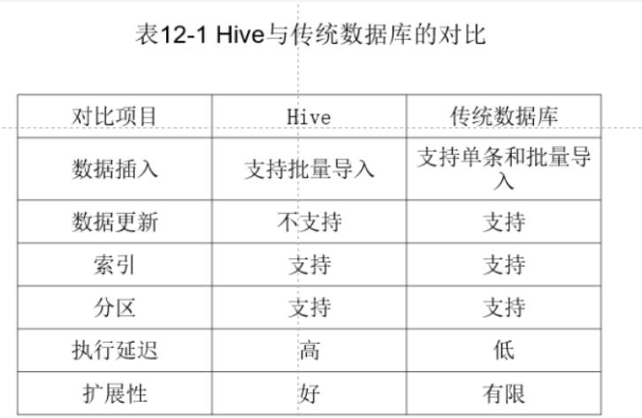
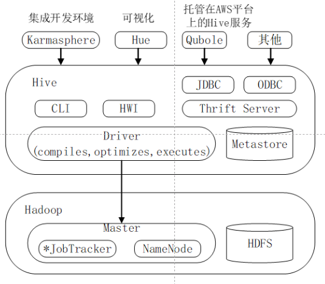

<!-- START doctoc generated TOC please keep comment here to allow auto update -->
<!-- DON'T EDIT THIS SECTION, INSTEAD RE-RUN doctoc TO UPDATE -->

- [Hive](#hive)
  - [Hive简介](#hive%E7%AE%80%E4%BB%8B)
    - [特点](#%E7%89%B9%E7%82%B9)
    - [优势](#%E4%BC%98%E5%8A%BF)
  - [Hive系统架构](#hive%E7%B3%BB%E7%BB%9F%E6%9E%B6%E6%9E%84)
    - [查询执行过程](#%E6%9F%A5%E8%AF%A2%E6%89%A7%E8%A1%8C%E8%BF%87%E7%A8%8B)
    - [注意事项](#%E6%B3%A8%E6%84%8F%E4%BA%8B%E9%A1%B9)
    - [Hive NoSuchMethodError报错解决](#hive-nosuchmethoderror%E6%8A%A5%E9%94%99%E8%A7%A3%E5%86%B3)
    - [Hadoop与Hive版本不兼容](#hadoop%E4%B8%8Ehive%E7%89%88%E6%9C%AC%E4%B8%8D%E5%85%BC%E5%AE%B9)
  - [Hive基本数据类型](#hive%E5%9F%BA%E6%9C%AC%E6%95%B0%E6%8D%AE%E7%B1%BB%E5%9E%8B)
  - [Hive外部表，内部表](#hive%E5%A4%96%E9%83%A8%E8%A1%A8%E5%86%85%E9%83%A8%E8%A1%A8)
    - [内部表（管理表/具有生命周期）](#%E5%86%85%E9%83%A8%E8%A1%A8%E7%AE%A1%E7%90%86%E8%A1%A8%E5%85%B7%E6%9C%89%E7%94%9F%E5%91%BD%E5%91%A8%E6%9C%9F)
    - [外部表](#%E5%A4%96%E9%83%A8%E8%A1%A8)
    - [外部表和内部表区别](#%E5%A4%96%E9%83%A8%E8%A1%A8%E5%92%8C%E5%86%85%E9%83%A8%E8%A1%A8%E5%8C%BA%E5%88%AB)
    - [分区表](#%E5%88%86%E5%8C%BA%E8%A1%A8)
  - [Hive方法](#hive%E6%96%B9%E6%B3%95)
    - [启动Hive命令](#%E5%90%AF%E5%8A%A8hive%E5%91%BD%E4%BB%A4)
    - [退出命令](#%E9%80%80%E5%87%BA%E5%91%BD%E4%BB%A4)
    - [常见HiveQL命令](#%E5%B8%B8%E8%A7%81hiveql%E5%91%BD%E4%BB%A4)
    - [创建、查看、删除数据库和表格](#%E5%88%9B%E5%BB%BA%E6%9F%A5%E7%9C%8B%E5%88%A0%E9%99%A4%E6%95%B0%E6%8D%AE%E5%BA%93%E5%92%8C%E8%A1%A8%E6%A0%BC)
    - [创建表](#%E5%88%9B%E5%BB%BA%E8%A1%A8)
    - [创建视图](#%E5%88%9B%E5%BB%BA%E8%A7%86%E5%9B%BE)
    - [删除数据库、表、视图](#%E5%88%A0%E9%99%A4%E6%95%B0%E6%8D%AE%E5%BA%93%E8%A1%A8%E8%A7%86%E5%9B%BE)
      - [删除表](#%E5%88%A0%E9%99%A4%E8%A1%A8)
      - [删除视图](#%E5%88%A0%E9%99%A4%E8%A7%86%E5%9B%BE)
    - [修改数据库、表格、视图](#%E4%BF%AE%E6%94%B9%E6%95%B0%E6%8D%AE%E5%BA%93%E8%A1%A8%E6%A0%BC%E8%A7%86%E5%9B%BE)
      - [修改数据库](#%E4%BF%AE%E6%94%B9%E6%95%B0%E6%8D%AE%E5%BA%93)
      - [修改表](#%E4%BF%AE%E6%94%B9%E8%A1%A8)
      - [修改视图](#%E4%BF%AE%E6%94%B9%E8%A7%86%E5%9B%BE)
    - [查看视图数据库、表格、视图](#%E6%9F%A5%E7%9C%8B%E8%A7%86%E5%9B%BE%E6%95%B0%E6%8D%AE%E5%BA%93%E8%A1%A8%E6%A0%BC%E8%A7%86%E5%9B%BE)
      - [show命令查看数据库](#show%E5%91%BD%E4%BB%A4%E6%9F%A5%E7%9C%8B%E6%95%B0%E6%8D%AE%E5%BA%93)
      - [show命令查看表和视图](#show%E5%91%BD%E4%BB%A4%E6%9F%A5%E7%9C%8B%E8%A1%A8%E5%92%8C%E8%A7%86%E5%9B%BE)
      - [describe命令描述数据库、表、视图](#describe%E5%91%BD%E4%BB%A4%E6%8F%8F%E8%BF%B0%E6%95%B0%E6%8D%AE%E5%BA%93%E8%A1%A8%E8%A7%86%E5%9B%BE)
    - [load命令装载数据](#load%E5%91%BD%E4%BB%A4%E8%A3%85%E8%BD%BD%E6%95%B0%E6%8D%AE)
    - [insert插入命令](#insert%E6%8F%92%E5%85%A5%E5%91%BD%E4%BB%A4)

<!-- END doctoc generated TOC please keep comment here to allow auto update -->

[toc]

# Hive

## Hive简介

构建于Hadoop顶层的数据仓库工具。本身不存储和处理数据，依赖于HDFS存储数据，依赖分布式并行文件系统MapReduce处理数据，主要是定义了HiveSQL（类似于SQL）查询语言，通过编写HiveSQL运行MapReduce任务，具有较多数据类型

### 特点

- 支持批处理方式处理海量数据
- 支持对数据加载转化，可以查询，存储，分析大规模数据
- 处理静态数据，能够与Hbase互补（hbase能够提供实时访问功能）
- 不支持数据更新，支持分区以及索引
- 图示
	- 

### 优势

- 在数据插入志宏，支持批量传入数据，为全表扫描
- 不支持数据更新，Hive存放静态数据
- 提供有限的索引

## Hive系统架构

- 用户接口模块

  包括CLI, HWJ, JDBC, ODBC, Thirft Sever，CLI为自带命令行界面， HWI为简单网页界面，JDBC，ODBC和Thrift Server是向用户提供编程访问的接口

- 驱动模块

  包括编译器，优化器，执行器，所有指令都会进入到驱动模块，按照步骤执行

  编译器为Antlr语言识别工具，将SQL转化为抽象语法树（AST tre），遍历为QueryBlock查询单元（包含输入源，计算过程，输出部分）

- 元数据存储模块

  独立关系型数据库，也可以为MYSQL连接，也可以为自带Derby数据库，保存表名称，表列以及属性，表的分区以及属性，表的数据所在位置信息

- 图示

  - 

### 查询执行过程

1. 用CLI输入命令
2. 编译器Antlr语言识别工具对SQL语言此法和语法解析，转化为抽象语法树（AST TREE）
3. 对AST TREE 遍历，转化为QueryBlock查询单元（基本SQL语法组成单元，包括输入源，计算过程和输出）
4. 对QueryBlock进行遍历，生成执行操作树（OperatorTree），逻辑操作符（TableScanOperator，SelectOperator，FilterOperator，JoinOperator，GroupByOperator）可在Map和Reduce阶段产生特点操作
5. Hive驱动模块中的逻辑优化器对OperatorTree进行优化（变换OperatorTree的形式，来合并多余的操作符）
6. 对优化后的OperatorTree进行遍历，根据OperatorTree中的逻辑操作符生成需要执行的MapReduce任务
7. 启动Hive板块的物理优化器，对MapReduce任务优化
8. Hive驱动执行器，对MapReduce任务执行

### 注意事项

1. 启动MapReduce程序时，Hive本身是不会生成MapReduce算法程序
2. “job执行计划”的XML文件驱动执行内置的、原生的Mapper和Reducer模块
3. Hive通过和JobTracker通信来初始化MapReduce任务，不需要通过JobTracker管理节点执行

### Hive NoSuchMethodError报错解决

1. 复制高版本jar包到hive中
2. 删除低版本jar包

3. 复制保留jar包到原文件夹
   -  cp ~/Downloads/guava-14.0.1.jar /usr/local/hive/lib/

4. 删除高版本jar包（hive）

### Hadoop与Hive版本不兼容

报错具体如下所示。

java.lang.IllegalArgumentException: Unrecognized Hadoop major version number: 3.1.3（目前只有降低hadoop版本并重新配置）

Exception in thread "main" java.lang.IllegalAccessError: tried to access method com.google.common.collect.Iterators.emptyIterator()Lcom/google/common/collect/UnmodifiableIterator; （也是因为guava-14.0.1.jar版本不兼容导致）

## Hive基本数据类型

基本数据类型

- TINYINT: 1个字节
- SMALLINT: 2个字节
- INT: 4个字节
- BIGINT: 8个字节
- BOOLEAN: TRUE/FALSE
- FLOAT: 4个字节，单精度浮点型
- DOUBLE: 8个字节，双精度浮点型STRING 字符串

复杂数据类型

- ARRAY: 有序字段（数组类似）
- MAP: 无序字段（字典类似)
- STRUCT: 一组命名的字段（结构体）

## Hive外部表，内部表

### 内部表（管理表/具有生命周期）

- 默认创建的表都是所谓的内部表，有时也被称为管理表。
- Hive 控制着数据的生命周期。Hive 默认情况下会将这些表的数据存储在由配置项hive.metastore.warehouse.dir(例如，/user/hive/warehouse)所定义的目录的子目录下。
- 当我们删除一个内部表时，Hive 也会删除这个表中数据。
- 管理表不适合和其他工具共享数据。

### 外部表

- 在创建表时可以自己指定目录位置(LOCATION)
- 删除外部表时，只会删除元数据不会删除表数据;

具体关键命令为` LOCATION '/hive/emp_partition'`

### 外部表和内部表区别

- 创建内部表时：会将数据移动到数据仓库指向的路径;
- 创建外部表时：仅记录数据所在路径，不对数据的位置做出改变;
- 删除内部表时：删除表元数据和数据;
- 删除外部表时，删除元数据，不删除数据。

### 分区表

- 分区表实际上就是对应一个 HDFS 文件系统上的独立的文件夹，该文件夹下是该分区所有的数据文件。

- Hive 中的分区就是分目录，把一个大的数据集根据业务需要分割成小的数据集。主要用于提高查询效率。

- 需要指定表中的其中一个字段，这个就是根据该字段的不同，划分不同的文件夹。

具体关键命令为` PARTITIONED BY (deptno INT)`

## Hive方法

### 启动Hive命令

```
/usr/local/hadoop/sbin/start-all.sh
/usr/local/hadoop/sbin/start-dfs.sh
/usr/local/hadoop/sbin/start-yarn.sh

/usr/local/hive/bin/hive
```

如果遇见错误，Hive metastore database is not initialized，即为启动以下命令即可。`schematool -dbType mysql -initSchema`

报错原因具体如下所示

> 以前曾经安装了Hive或MySQL，重新安装Hive和MySQL以后，导致版本、配置不一致。解决方法是，使用schematool工具。Hive现在包含一个用于 Hive Metastore 架构操控的脱机工具，名为 schematool.此工具可用于初始化当前 Hive 版本的 Metastore 架构

### 退出命令

`exit;`

### 常见HiveQL命令

### 创建、查看、删除数据库和表格

```
create database if not exists hive;       #创建数据库
show databases;                           #查看Hive中包含数据库
show databases like 'h.*';                #查看Hive中以h开头数据库
describe databases;                       #查看hive数据库位置等信息
alter database hive set dbproperties;     #为hive设置键值对属性
use hive(datasets_name);                                 #切换到hive数据库下
drop database if exists hive;             #删除不含表的数据库
drop database if exists hive cascade;     #删除数据库和它中的表
```

备注：除 **dbproperties**属性外，数据库的元数据信息都是不可更改的，包括数据库名和数据库所在的目录位置，没有办法删除或重置数据库属性。

### 创建表

1. 在hive数据库中，创建表usr，含三个属性id，name，age

```
use hive;
create table if not exists usr(id bigint,name string,age int);

```

2. 在hive数据库中，创建表usr，含三个属性id，name，age，**存储路径**为“/usr/local/hive/warehouse/hive/usr”，核心代码为` location ‘/usr/local/hive/warehouse/hive/usr’`

```
create table if not exists hive.usr(id bigint,name string,age int) location ‘/usr/local/hive/warehouse/hive/usr’;

```

3. 在hive数据库中，创建**外部表**usr，含三个属性id，name，age，可以**读取路径**“/usr/local/data”下以**“，”分隔**的数据。主要的核心代码为` >row format delimited fields terminated by ','`

```
create external table if not exists hive.usr(id bigint,name string,age int) row format delimited fields terminated by ',' location ‘/usr/local/data’;

```

4. 创建分区表usr，含三个属性id，name，age，还存在分区字段sex。

```
create table hive.usr(id bigint,name string,age int) partition by(sex boolean);
```

5. 复制表格

```
create table if not exists usr1 like usr;
```

### 创建视图

1. 创建视图little_usr，只包含usr表中id，age属性

```
create view little_usr as select id,age from usr;
```

### 删除数据库、表、视图

#### 删除表

删除表usr，如果是**内部表**，元数据和实际数据都会被删除；如果是**外部表**，只删除元数据，不删除实际数据

```
drop table if exists usr;
```

#### 删除视图

```
drop view if exists little_usr;
```

### 修改数据库、表格、视图

#### 修改数据库

   为hive数据库设置dbproperties键值对属性值来描述数据库属性信息

   ```
alter database hive set dbproperties(‘edited-by’=’lily’);
   ```

#### 修改表

   - 重命名表usr为user

     ```
     alter table usr rename to user;
     ```

   - 为表usr增加新分区

     ```
     alter table usr add if not exists partition(age=10);
     ```

   - 删除表usr中分区

     ```
     alter table usr drop if exists partition(age=10);
     ```

   - 把表usr中列名name修改为username，并把该列置于age列后

     ```
     alter table usr change name username string after age;
     ```

   - 在对表usr分区字段之前，增加一个新列sex

     ```
     alter table usr add columns(sex boolean);
     ```

   - 删除表usr中所有字段并重新指定新字段newid，newname，newage

     ```
     alter table usr replace columns(newid bigint,newname string,newage int);
     ```

   - 为usr表设置tblproperties键值对属性值来描述表的属性信息

     ```
     alter table usr set tabproperties(‘notes’=’the columns in usr may be null except id’);
     ```

#### 修改视图

   - 修改little_usr视图元数据中的tblproperties属性信息

     ```
     alter view little_usr set tabproperties(‘create_at’=’refer to timestamp’);
     ```

### 查看视图数据库、表格、视图

####  show命令查看数据库

1. 查看Hive中包含的所有数据库

   ```
   show databases;
   ```

2. 查看Hive中以h开头的所有数据库

```
show databases like ‘h.*’;
```

#### show命令查看表和视图

1. 查看数据库hive中所有表和视图

```
use hive;
show tables;
```

2. 查看数据库hive中以u开头的所有表和视图

```
 show tables in hive like ‘u.*’;
```

#### describe命令描述数据库、表、视图

1. 查看数据库hive的基本信息，包括数据库中文件位置信息等

```
describe database hive;
```

2. 查看数据库hive的详细信息，包括数据库的基本信息及属性信息等

```
describe database extended hive;
```

3. 查看表usr和视图little_usr的基本信息，包括列信息等

```
describe hive.usr 或者 hive.little_usr;
```

4. 查看表usr和视图little_usr的详细信息，包括列信息、位置信息、属性信息等

```
describe extended hive.usr 或者 hive.little_usr;
```

5. 查看表usr中列id的信息

```
describe extended hive.usr.id;
```

### load命令装载数据

1. 把**linux文件系统目录**’/usr/local/data‘下的数据文件中的数据装载进usr表并覆盖原有数据，主要为**overwrite命令**

```
load data local inpath ‘/usr/local/data’ overwrite into table usr;
```

2. 把目录’/usr/local/data‘下的数据文件中的数据装载进usr表不覆盖原有数据，主要为**into命令**

```
load data local inpath ‘/usr/local/data’ into table usr;
```

3. 把分布式文件系统目录’hdfs://master_srever/usr/local/data‘下的数据文件数据装载进usr表并覆盖原有数据，主要为缺少了一个**local inpath 命令**

```
load data inpath ‘hdfs://master_srever/usr/local/data’ overwrite into  table usr;
```

### insert插入命令

1. 向表usr1中插入来自usr表的数据并覆盖原有数据

```
insert overwrite table usr1 select * from usr where age=10;
```

2. 向表usr1中插入来自usr表的数据并追加在原有数据后

```
insert into table usr1 select * from usr where age=10;
```

