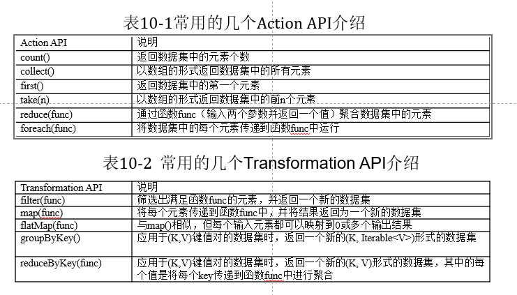
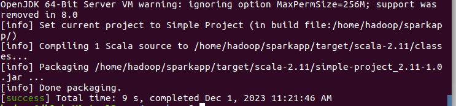

<!-- START doctoc generated TOC please keep comment here to allow auto update -->
<!-- DON'T EDIT THIS SECTION, INSTEAD RE-RUN doctoc TO UPDATE -->

- [Spark特点](#spark%E7%89%B9%E7%82%B9)
- [Scala介绍](#scala%E4%BB%8B%E7%BB%8D)
- [Spark与Hadoop对比优势](#spark%E4%B8%8Ehadoop%E5%AF%B9%E6%AF%94%E4%BC%98%E5%8A%BF)
- [Spark运行架构](#spark%E8%BF%90%E8%A1%8C%E6%9E%B6%E6%9E%84)
- [Spark代码实践](#spark%E4%BB%A3%E7%A0%81%E5%AE%9E%E8%B7%B5)
  - [启动Spark shell命令行](#%E5%90%AF%E5%8A%A8spark-shell%E5%91%BD%E4%BB%A4%E8%A1%8C)
    - [shell优点](#shell%E4%BC%98%E7%82%B9)
  - [创建RDD（导入数据）](#%E5%88%9B%E5%BB%BArdd%E5%AF%BC%E5%85%A5%E6%95%B0%E6%8D%AE)
  - [RDD.count()统计文本文件行数](#rddcount%E7%BB%9F%E8%AE%A1%E6%96%87%E6%9C%AC%E6%96%87%E4%BB%B6%E8%A1%8C%E6%95%B0)
  - [RDD.filter()函数，满足条件被添加](#rddfilter%E5%87%BD%E6%95%B0%E6%BB%A1%E8%B6%B3%E6%9D%A1%E4%BB%B6%E8%A2%AB%E6%B7%BB%E5%8A%A0)
  - [RDD.contains()函数，如果包含，就返回对应数值](#rddcontains%E5%87%BD%E6%95%B0%E5%A6%82%E6%9E%9C%E5%8C%85%E5%90%AB%E5%B0%B1%E8%BF%94%E5%9B%9E%E5%AF%B9%E5%BA%94%E6%95%B0%E5%80%BC)
  - [链式操作](#%E9%93%BE%E5%BC%8F%E6%93%8D%E4%BD%9C)
  - [实现MapReduce过程（运用map()和reduce()）](#%E5%AE%9E%E7%8E%B0mapreduce%E8%BF%87%E7%A8%8B%E8%BF%90%E7%94%A8map%E5%92%8Creduce)
    - [Map()](#map)
    - [Reduce()函数](#reduce%E5%87%BD%E6%95%B0)
  - [常见Action和Transformer函数的API（重要）](#%E5%B8%B8%E8%A7%81action%E5%92%8Ctransformer%E5%87%BD%E6%95%B0%E7%9A%84api%E9%87%8D%E8%A6%81)
  - [退出shell命令](#%E9%80%80%E5%87%BAshell%E5%91%BD%E4%BB%A4)
  - [SBT simple bulid tool 打包scala命令行](#sbt-simple-bulid-tool-%E6%89%93%E5%8C%85scala%E5%91%BD%E4%BB%A4%E8%A1%8C)
    - [1. 创建程序根目录，并创建程序所需的文件夹结构](#1-%E5%88%9B%E5%BB%BA%E7%A8%8B%E5%BA%8F%E6%A0%B9%E7%9B%AE%E5%BD%95%E5%B9%B6%E5%88%9B%E5%BB%BA%E7%A8%8B%E5%BA%8F%E6%89%80%E9%9C%80%E7%9A%84%E6%96%87%E4%BB%B6%E5%A4%B9%E7%BB%93%E6%9E%84)
    - [2. 创建文件](#2-%E5%88%9B%E5%BB%BA%E6%96%87%E4%BB%B6)
    - [3. 创建一个simple.bat文件](#3-%E5%88%9B%E5%BB%BA%E4%B8%80%E4%B8%AAsimplebat%E6%96%87%E4%BB%B6)
    - [4. 运用sbt对应用程序打包](#4-%E8%BF%90%E7%94%A8sbt%E5%AF%B9%E5%BA%94%E7%94%A8%E7%A8%8B%E5%BA%8F%E6%89%93%E5%8C%85)
    - [5. 运行sbt生成抓包结果](#5-%E8%BF%90%E8%A1%8Csbt%E7%94%9F%E6%88%90%E6%8A%93%E5%8C%85%E7%BB%93%E6%9E%9C)

<!-- END doctoc generated TOC please keep comment here to allow auto update -->

[toc]

# Spark特点

- 运行速度快：使用DAG执行引擎以支持循环数据流与内存计算

- 容易使用：支持使用Scala、Java、Python和R语言进行编程，可以通过Spark Shell进行交互式编程 

- 通用性：Spark提供了完整而强大的技术栈，包括SQL查询、流式计算、机器学习和图算法组件

- 运行模式多样：可运行于独立的集群模式中，可运行于Hadoop中，也可运行于Amazon EC2等云环境中，并且可以访问HDFS、Cassandra、HBase、Hive等多种数据源 

# Scala介绍

- Scala是Spark的主要编程语言，但Spark还支持Java、Python、R作为编程语言

- Scala的优势是提供了REPL（Read-Eval-Print Loop，交互式解释器），提高程序开发效率

- Scala具备强大的**并发性**，支持**函数式编程**，可以更好地支持分布式系统

  Scala语法简洁，能提供规范的API

# Spark与Hadoop对比优势

- Spark的计算模式也属于MapReduce，但不局限于Map和Reduce操作，还提供了**多种数据集操作类型**，编程模型比Hadoop MapReduce更灵活

- Spark提供了**内存计算**，可将中间结果放到内存中，对于迭代运算效率更高

- Spark基于DAG的**任务调度执行**机制，要优于Hadoop MapReduce的迭代执行机制 

# Spark运行架构

（未写）

# Spark代码实践

## 启动Spark shell命令行

```
cd /usr/local/spark
./bin/spark-shell
```

### shell优点

- Spark Shell 提供了简单的方式来学习Spark API

- Spark Shell可以以实时、交互的方式来分析数据

- Spark Shell支持Scala和Python

操作对象为RDD,RDD可以从外部导入数据，或者由其他的RDD转换

## 创建RDD（导入数据）

```
val textFile = sc.textFile("file:///usr/local/spark/README.md")  // 通过file:前缀指定读取本地文件

```

如果为HDFS文件系统中上传数据，即为将file改为hdfs://localhost:9000（代表的是hadoop文件系统所在的根目录**/**）即可。

关键为**file://**从文件中读取数据，而且Spark RDD支持两种操作。

1. 动作（action）：在数据集上进行运算，返回计算值
2. 转换（transformation）： 基于现有的数据集**创建**一个新的数据集

- 

## RDD.count()统计文本文件行数

```
textFile.count()
```

输出结果 Long = 95（ “Long=95”表示该文件共有95行内容）。

## RDD.filter()函数，满足条件被添加

```
val linesWithSpark = textFile.filter(line => line.contains("Spark"))
linesWithSpark.count()

```

存储一个新的变量，即为用RDD.filter()，在line=>line.contains()函数中不断遍历，而且line里可能是每一行遍历，如果包含了spark，那就赋值给line

## RDD.contains()函数，如果包含，就返回对应数值

## 链式操作

Spark支持链式操作，链式操作具体如下，即为在上一函数的结果后再次运行。在filter函数之后直接再次运行count()函数。具体如图所示。

```
val linesCountWithSpark 
= textFile.filter(line => line.contains("Spark")).count()
```

## 实现MapReduce过程（运用map()和reduce()）

1. 首先使用flatMap()将每一行的文本内容通过空格进行划分为单词；
2. 再使用map()将单词映射为(K,V)的键值对，其中K为单词，V为1；
3. 最后使用reduceByKey()将相同单词的计数进行相加，最终得到该单词总的出现的次数。
4. 输出结果 Long = 95（ “Long=95”表示该文件共有95行内容）

```
val wordCounts = textFile.flatMap(line => line.split(" ")).map(word => (word, 1)).reduceByKey((a, b) => a + b)
wordCounts.collect() // 输出单词统计结果
// Array[(String, Int)] = Array((package,1), (For,2), (Programs,1), (processing.,1), (Because,1), (The,1)...)

```

### Map()

map(func)函数主要是将元素传递到函数中，将结果返回成一个新的输出结果。

例子为`map(word => (word, 1))`，**word => (word, 1)**为一个函数，初始化切分后的词，为(key, value)格式，而且value为1。

### Reduce()函数

reduce()函数主要是将元素传递到函数，并输入两个参数并返回一个数值，开金额数据集中的元素。

## 常见Action和Transformer函数的API（重要）


## 退出shell命令

```
:quit
```

## SBT simple bulid tool 打包scala命令行

查看是否安装sbt，如果没有安装正常安装即可。

```
cd /usr/local/sbt
./sbt sbtVersion
```

### 1. 创建程序根目录，并创建程序所需的文件夹结构

```
mkdir ~/sparkapp                 # 创建程序根目录
mkdir -p ~/sparkapp/src/main/scala   # 创建程序所需的文件夹结构
```

### 2. 创建文件

```
gedit ~/sparkapp/src/main/scala/SimpleApp.scala
```

案例代码具体如下所示。

```
import org.apache.spark.SparkContext
import org.apache.spark.SparkContext._
import org.apache.spark.SparkConf
 
object SimpleApp {
  def main(args: Array[String]) {
    val logFile = "file:///usr/local/spark/README.md" // 用于统计的文本文件
    val conf = new SparkConf().setAppName("Simple Application")
    val sc = new SparkContext(conf)
    val logData = sc.textFile(logFile, 2).cache()
    val numAs = logData.filter(line => line.contains("a")).count()
    val numBs = logData.filter(line => line.contains("b")).count()
    println("Lines with a: %s, Lines with b: %s".format(numAs, numBs))
  }
}
```


### 3. 创建一个simple.bat文件

声明该应用程序的信息以及与Spark的依赖关系，具体内容如下。

先进入对应文件路径和创建文件`gedit ~/sparkapp/simple.sbt`

对应文件和内容都需要修改。

```
name := "Simple Project"
version := "1.0"
scalaVersion := "2.11.8"
libraryDependencies += "org.apache.spark" %% "spark-core" % "2.1.0"
```

### 4. 运用sbt对应用程序打包

打包成功后，会输出程序jar包的位置以及“Done Packaging”的提示

```
cd ~/sparkapp
/usr/local/sbt/sbt package
```

结果如下图所示。



### 5. 运行sbt生成抓包结果

```
/usr/local/spark/bin/spark-submit --class "SimpleApp" ~/sparkapp/target/scala-2.11/simple-project_2.11-1.0.jar
```

