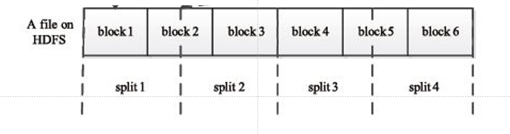
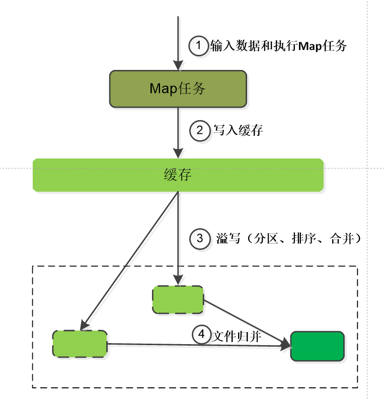
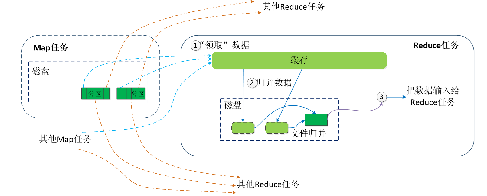
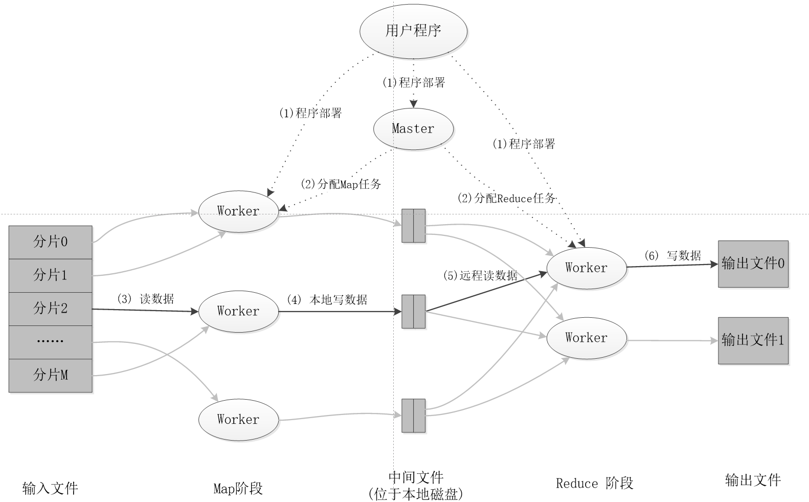

<!-- START doctoc generated TOC please keep comment here to allow auto update -->
<!-- DON'T EDIT THIS SECTION, INSTEAD RE-RUN doctoc TO UPDATE -->

- [大数据技术笔记](#%E5%A4%A7%E6%95%B0%E6%8D%AE%E6%8A%80%E6%9C%AF%E7%AC%94%E8%AE%B0)
  - [MapReduce](#mapreduce)
    - [MapReduce模型简介](#mapreduce%E6%A8%A1%E5%9E%8B%E7%AE%80%E4%BB%8B)
    - [MapReduce应用](#mapreduce%E5%BA%94%E7%94%A8)
    - [MapReduce代码编写（以词频统计为例）](#mapreduce%E4%BB%A3%E7%A0%81%E7%BC%96%E5%86%99%E4%BB%A5%E8%AF%8D%E9%A2%91%E7%BB%9F%E8%AE%A1%E4%B8%BA%E4%BE%8B)
    - [MapReduce命令行编译打包代码以及运行jar可执行文件](#mapreduce%E5%91%BD%E4%BB%A4%E8%A1%8C%E7%BC%96%E8%AF%91%E6%89%93%E5%8C%85%E4%BB%A3%E7%A0%81%E4%BB%A5%E5%8F%8A%E8%BF%90%E8%A1%8Cjar%E5%8F%AF%E6%89%A7%E8%A1%8C%E6%96%87%E4%BB%B6)
      - [命令行编译](#%E5%91%BD%E4%BB%A4%E8%A1%8C%E7%BC%96%E8%AF%91)
      - [IDE执行编译程序](#ide%E6%89%A7%E8%A1%8C%E7%BC%96%E8%AF%91%E7%A8%8B%E5%BA%8F)

<!-- END doctoc generated TOC please keep comment here to allow auto update -->

[toc]

# 大数据技术笔记

## MapReduce

### MapReduce模型简介

一般是用于mster-slave框架，master运行jobTracer， slave运行TaskTracer

- Map函数

  Map函数应用于将数据解析为<key,value>，输入为<k1,v1>,输出为list(<k1,v2>)

- Reduce函数

  输入为list(<k1,v2>)，输出为同一个批次的<k3, v3>

执行阶段为以下几个步骤。

1. 输入

2. 切片

   HDFS是按照固定block为基本单位存储，因此，处理单位为split（包含元数据，数据长度，节点位置等，起始信息）用户自定义，与HDFS的block无一定关系

  -  

3. Map

   理想为一个split等于一个block

4. Shuffle

   Map之后进入缓存，随后进行溢写（分区，排序，合并），磁盘归并，随后被Reduce取走

   归并（combine）和合并（merge）的区别：两个键值对<“a”,1>和<“a”,1>，如果合并，会得到<“a”,2>，如果归并，会得到<“a”,<1,1>>

   （合并为加法，归并为整合，但不想加）

    - 

    - 

5. Reduce

 - 

### MapReduce应用

- 关系代数运算（选择，投影，交，并，差，连接）
- 分组聚合
- 矩阵-向量乘法
- 矩阵乘法

### MapReduce代码编写（以词频统计为例）

- MapReduce输入

  期望为<key,value>，在java中<Object,Text>

- MapReduce输出

  期望为<单词，出现次数>，在java中为<Text,IntWritable>

- Reduce输入

  期望为<key,Iterable容器>

在java中，都需要extend发方法为Map或Reduce，在main方法里面需要设置如下。

```
public static void main(String[] args) throws Exception{  
	    Configuration conf = new Configuration();  
	    String[] otherArgs = new GenericOptionsParser(conf,args).getRemainingArgs();  
	                if (otherArgs.length != 2)  
	                {  
	                        System.err.println("Usage: wordcount <in> <out>");  
	                        System.exit(2);  
	                }  
	                Job job = new Job(conf,"word count");  
	                job.setJarByClass(WordCount.class);  
	                job.setMapperClass(MyMapper.class);  
	                job.setReducerClass(MyReducer.class);  
	                job.setOutputKeyClass(Text.class);  
	                job.setOutputValueClass(IntWritable.class);  
	                FileInputFormat.addInputPath(job,new Path(otherArgs[0]));  
	                FileOutputFormat.setOutputPath(job,new Path(otherArgs[1]));  
	                System.exit(job.waitForCompletion(true)?0:1);  
	        }  

```

### MapReduce命令行编译打包代码以及运行jar可执行文件

#### 命令行编译

添加环境变量到~/.bashrc中（环境变量）

```
export HADOOP_HOME=/usr/local/hadoop

export CLASSPATH=$($HADOOP_HOME/bin/hadoop classpath):$CLASSPATH
```

- $HADOOP_HOME/share/hadoop/common/hadoop-common-3.1.3.jar

- $HADOOP_HOME/share/hadoop/mapreduce/hadoop-mapreduce-client-core-3.1.3.jar

- $HADOOP_HOME/share/hadoop/common/lib/commons-cli-1.2.jar

编译代码(前提是需要将hadoop的classpath加入到环境变量中)

```
javac wordcount.java
jar -cvf wordcount.jar ./wordcount*.class
```

#### IDE执行编译程序

必须需要的jar包如下（运用eclipse或者idea导包）

- “/usr/local/hadoop/share/hadoop/common”目录下的hadoop-common-3.1.3.jar和haoop-nfs-3.1.3.jar；

- “/usr/local/hadoop/share/hadoop/common/lib”目录下的所有JAR包

- “/usr/local/hadoop/share/hadoop/mapreduce”目录下的所有JAR包

- “/usr/local/hadoop/share/hadoop/mapreduce/lib”目录下的所有JAR包

具体命令如下所示。

```
# 删除hadoop所在的文件夹
cd /usr/local/hadoop
./bin/hdfs dfs -rm -r output
./bin/hdfs dfs -rm -r input
# 创建hadoop文件夹
cd /usr/local/hadoop
./bin/hdfs dfs -mkdir input
# 将数据放置在hadoop制定文件夹中
cd /usr/local/hadoop
./bin/hdfs dfs -put ./wordfile1.txt input
./bin/hdfs dfs -put ./wordfile2.txt input
# 删除hadoop所在的文件夹
cd /usr/local/hadoop
./bin/hdfs dfs -rm -r /user/hadoop/output
# 运行已经打包好的java包，参数为jar 输入文件夹 输出文件夹
cd /usr/local/hadoop
./bin/hadoop jar ./myapp/WordCount.jar input output
# 输出结果
cd /usr/local/hadoop
./bin/hdfs dfs -cat output/*


```

