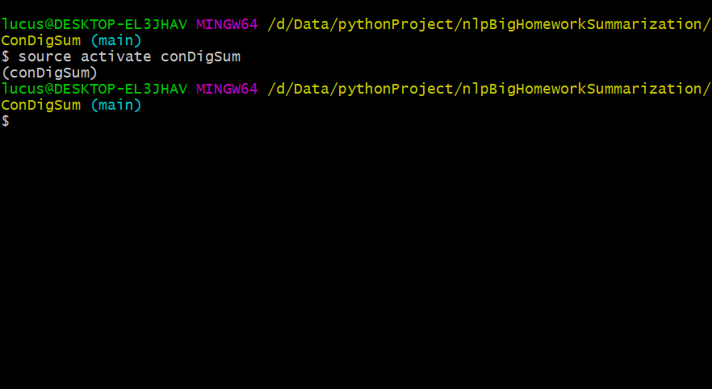

# Git指令集合
## 参考：https://blog.csdn.net/zhezhebie/article/details/78761417

## 设置github邮箱以及账号

1.  git config --globaluser.name"LucasandElliot"

2. git config --globaluser.email"xxxxxx@xx.com"

##  设置SSH key钥匙
检查是否已经生成密钥
1. cd ~/.ssh
如果返回了三个文件证明已经生成了密钥
如果没有密钥，即为输入以下命令
1. ssh-keygen -t rsa -C "xxxxxx@xx.com"
随后直接回车即可，即为默认路径以及默认没有密码登录
查看 SSH key的输出，复制输出到剪贴板，随后打开github的setting，检索是否有SSH，随后创建即可
1. cat ~/.ssh/id_rsa.pub
## 上传文件
进入对应文件夹，随后初始化git文件夹，执行对应指令，但需要先关联仓库地址(这里需要为Https形式文件/git后缀文件)
1. cd C:/Users/lucus/Desktop/Typora_note
2. git init
3. git remote add orgin git@github.com:LucasandElliot/note.git
4. git add .  /git add --all
5. git commit -m "提交文件，即为文件提交注释"
6. git push -u origin master(branch)

## 更新库的文件

如果已经存在readme文件，提交的时候可能会有冲突，因此需要有以下两种操作
- 舍弃线上文件，强制推送
	1. git push origin master -f
- 保留线上文件，用于合并远程仓库（通常是命名为 "origin"）的 "master" 分支拉取最新的更新到本地仓库。
	1. git pull origin master
	2. git push origin master
## 查询对应仓库路径
1. git remote -v
## 修改远程仓库地址
1. git remote set-url origin <your_remote_url>

## 添加远程仓库

1. git remote add origin 项目地址(url.git 或者是git.git)如【 git@github.com:LucasandElliot/note.git】

## 删除远程仓库地址

- ```
  git remote remove orgin（需要删除的代名词或分支）
  ```

## git查看回退历史记录

参考：https://blog.csdn.net/jacke121/article/details/54565222

命令具体如下所示

1. git log
2. git reset --hard commit_id

## git更新仓库并上传文件

1. git pull origin master
2. git push origin master
3. git add .  /git add --all
4. git commit -m "提交文件，即为文件提交注释"
5. git push -u origin master(branch)

## Git激活虚拟环境

主要要求你的venv的script文件夹需要有activate文件和activate.bat文件

具体命令如下所示。打开所需要激活的文件夹。如图所示。

`source activate conDigSum`



## 移除文件缓存

```
git rm --cached your_path_file
```

## 移除文件夹缓存

```
git rm --cached -r path_of_the_dir
```

## 上传大文件

1. 安装lfs

   ```
   git lfs install
   ```

2. 设置需要上传的大文件后缀

   ```
   git lfs track "*.dll" 
   ```

3. 确定初始化

   ```
    git add .gitattributes
   ```

4. 随后正常push和pull即可

## 合并分支

1. 切换到main分支

   ```
   git checkout main
   ```

2. 将main分支代码pull拖拉下来

   ```
   git pull orgin main

3. 合并master分支

   ```
   git merge master
   ```

4. 查看状态以及执行提交指令

   ```
   git status
   ```

5. push代码进入到指令中

   ```
   git push origin main
   ```

## 删除本地master分支

```
git branch -d master
```

## 删除git的commit记录

1. 查看记录

   ```
   git log
   ```

2. 设置改写从xx记录之后所有记录的权限

   ```
   git rebase -i 
   ```

3. 运用vim打开commit log list，随后将pick改为drop即可，保存文件。随后再次推送

## 撤回没有被上传的commit指令

```
git reset  HEAD^
```

- --mixed， 不改动工作空间代码，但是撤销commit，以及git add 操作，一般为默认操作
- --soft， 不删除工作空间以及代码，撤销commit。不撤销git add .
- --hard，删除工作空间改动diam，撤销commit， 撤销git add . 这个执行之后，就恢复到了上次commit的状态
- HEAD^是回退到上一次，HEAD~2是回退上两次（而且是会根据执行之后再次回退，即为先执行HEAD^，后执行HEAD~2一共会回退3次）
