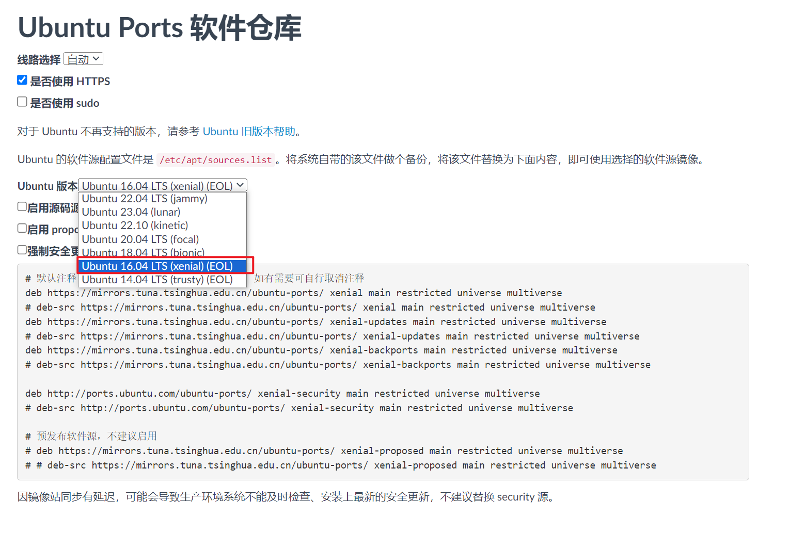

<!-- START doctoc generated TOC please keep comment here to allow auto update -->
<!-- DON'T EDIT THIS SECTION, INSTEAD RE-RUN doctoc TO UPDATE -->

- [备份source.list](#%E5%A4%87%E4%BB%BDsourcelist)
- [更换以及修改对应版本镜像源](#%E6%9B%B4%E6%8D%A2%E4%BB%A5%E5%8F%8A%E4%BF%AE%E6%94%B9%E5%AF%B9%E5%BA%94%E7%89%88%E6%9C%AC%E9%95%9C%E5%83%8F%E6%BA%90)

<!-- END doctoc generated TOC please keep comment here to allow auto update -->

[toc]

# 备份source.list

- ```
  sudo cp /etc/apt/sources.list /etc/apt/sources.list.bak
  ```

# 更换以及修改对应版本镜像源

- ```
  sudo gedit /etc/apt/sources.list 
  # 修改对应的soucrecs.list文件
  ```

- 清华镜像源网站【Ubuntu为例】
  - ARM-64架构
    - https://mirrors.tuna.tsinghua.edu.cn/help/ubuntu-ports/
  - x86结构以及32/64位系统
    - https://mirrors.tuna.tsinghua.edu.cn/help/ubuntu/
- 选择对应系统版本的apt【以ARM为例】
  - 

- 执行更新即可

  - ```
    sudo apt-get update
    sudo apt-get upgrade
    ```

- 随后等待更新成功即可

  - server certificate verification failed，将https更换为http即可
  - CAfile: /etc/ssl/certs/ca-certificates.crt CRLfile: none 将https更换为http即可，或者查看对应笔记