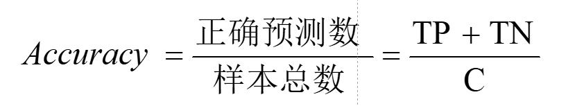
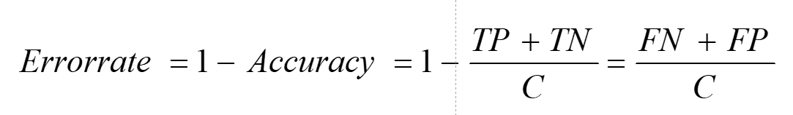
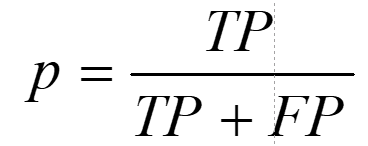
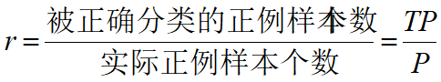
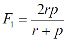

<!-- START doctoc generated TOC please keep comment here to allow auto update -->
<!-- DON'T EDIT THIS SECTION, INSTEAD RE-RUN doctoc TO UPDATE -->

- [二元分类问题的混淆矩阵](#%E4%BA%8C%E5%85%83%E5%88%86%E7%B1%BB%E9%97%AE%E9%A2%98%E7%9A%84%E6%B7%B7%E6%B7%86%E7%9F%A9%E9%98%B5)
- [计算准确率（accuracy）](#%E8%AE%A1%E7%AE%97%E5%87%86%E7%A1%AE%E7%8E%87accuracy)
- [计算分类差错率（errorrate）](#%E8%AE%A1%E7%AE%97%E5%88%86%E7%B1%BB%E5%B7%AE%E9%94%99%E7%8E%87errorrate)
- [精度/查准率（precision）【针对于分类】](#%E7%B2%BE%E5%BA%A6%E6%9F%A5%E5%87%86%E7%8E%87precision%E9%92%88%E5%AF%B9%E4%BA%8E%E5%88%86%E7%B1%BB)
- [召回率/查全率（recall）【针对于实际】](#%E5%8F%AC%E5%9B%9E%E7%8E%87%E6%9F%A5%E5%85%A8%E7%8E%87recall%E9%92%88%E5%AF%B9%E4%BA%8E%E5%AE%9E%E9%99%85)
- [F1度量【调和平均值】](#f1%E5%BA%A6%E9%87%8F%E8%B0%83%E5%92%8C%E5%B9%B3%E5%9D%87%E5%80%BC)

<!-- END doctoc generated TOC please keep comment here to allow auto update -->

# 二元分类问题的混淆矩阵

- 
- TP为数量少的类别被正确预测
- FN为数量少的类别被错误预测
- FP为数量多的类别被错误预测
- TN为数量多的类别为正确预测

# 计算准确率（accuracy）

- 

# 计算分类差错率（errorrate）

- 

# 精度/查准率（precision）【针对于分类】

- 正确分类的正例个数占**分类**为正例的样本个数的比例
  - 

# 召回率/查全率（recall）【针对于实际】

- 正确分类的正例个数占**实际**正例个数的比例
  - 

# F1度量【调和平均值】

- F1度量表示精度和召回率的**调和平均**
  - 
  - r为召回率，p为精度