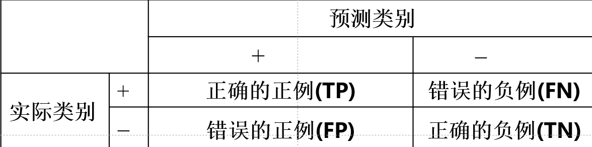

# 二元分类问题的混淆矩阵

- 
- TP为数量少的类别被正确预测
- FN为数量少的类别被错误预测
- FP为数量多的类别被错误预测
- TN为数量多的类别为正确预测

# 计算准确率（accuracy）

- 

# 计算分类差错率（errorrate）

- 

# 精度/查准率（precision）【针对于分类】

- 正确分类的正例个数占**分类**为正例的样本个数的比例
  - 

# 召回率/查全率（recall）【针对于实际】

- 正确分类的正例个数占**实际**正例个数的比例
  - 

# F1度量【调和平均值】

- F1度量表示精度和召回率的**调和平均**
  - 
  - r为召回率，p为精度