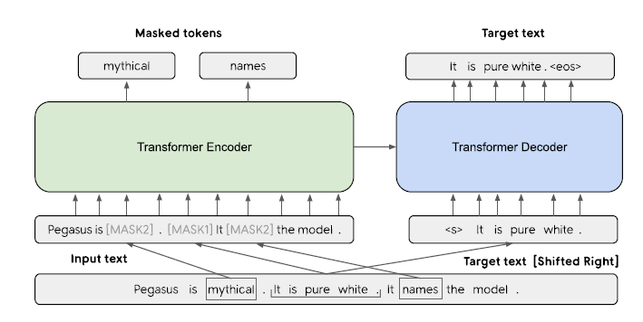
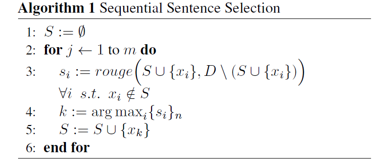

# PEGASUS介绍

## 概述

模型论文为Pre-training with Extracted Gap-sentences for Abstractive Summarization，简称为PEGASUS。面向的情况主要是因为目前预训练语言任务主要为MLM和NSP任务，即为掩码预测任务和下一句预测任务，**没有面向生成式文本摘要的预训练任务**。因此PEGASUS提出在预训练阶段的时候，将重要的句子作为MASK1，掩盖后，通过encoder-decoder的结构运用MASK1覆盖后的句子预测MASK1的句子，**在一定程度上模拟摘要生成**。

PEGASUS假设前提为**在预训练过程中，约接近下游任务的预训练任务可以获取更好的下游任务性能**。

PEGASUS模型的预训练任务主要有两个，分别为gap句子生成和掩码预测任务。Gap句子生成主要模拟抽取式摘要文本生成。

- GSS(Gap Sentence Generation)

- MLM（Mask Language Model）

## 模型框架图示

- MASK1为我们所**模拟生成式摘要**的句子，MASK2主要为MLM任务

# Gap Sentence Generation（GSG）

前提为预训练目标与下游任务约接近，finetune效果会更好。通过运用span mask的思想，将整个句子运用MSAK1遮盖预测，除此之外，将MASK1**拼接**为起来，形成一个**伪摘要**。Gap sentence ration（GSR）用于描述MASK1在文档中的总比例。

- $GSR = \frac{输入句子中MASK1总个数)}{输入句子中token总个数}$

但是**选择不同的句子**会有不一样的结果，因此提出了下列集中选择句子的方式。定义n个句子文档集$D = {x_i}n$，n为句子个数，$x_i$为第i个句子。D为文档。

- Random，随机选取m个句子
- Lead，选取文章中前m个句子
- Principal， 根据特定指标，选取得分高的top-m个句子

### Principle 选择方式

1. 独立性选择（independently，ind），根据选中句子和其他句子集合的ROUGE1-F1来计算，具体公式如下，最终选取前m个$s_i$句子。
   1. $s_i=rouge(x_i,D\setminus\{x_i\})$
2. 连续性选择（Sequential Sentence Selection，seq），通过贪婪最大化选择句子集合和其他句子子集的ROUGE1-F1值选取，具体算法描述如下所示。
   1. 

在计算ROUGE1-F1的时候存在**Uniq**和**Orig**，具体差异如下图所示。

- 如果为Uniq，即为先处理句子集合，去除重复的n-gram，再计算指标
- 如果为Orig，即为考虑保留原始句子，允许n-gram出现

Tip：Rouge-N实际上是将模型生成的结果和标准结果按N-gram拆分后，**计算召回率**。比如有2个句子（一般模型生成的成为hypothesis，简写hyp；标准结果称为reference，简写为ref）

$$Rouge{-}N=\frac{\sum_{S\in ReferenceSunmaries}Count_{match}(gram_n)}{\sum_{S\in ReferenceSumaries}\sum_{gram_n\in S}Count(gram_n)}$$

### 结论

最终得到一共有四种，结合之前的Random以及Lead，最终有Ind-Uniq，Ind-Orig，Seq-Uniq，Seq-Orig，Random，Lead共六种选择。

最终确定了将文档的SGR（选取30%）的句子作为Gap sentence句子，而且在选择MASK1的时候，运用Ind-Orig对方式，结果最好。

## MLM掩码预测任务选择

在文中共有三种方法。

1. 类似于BERT做法，输入文本的15%的tokens, 80%的被替换为[MASK2], 10%的被随机的token替换 10%未发生变化，在finetune的时候共享encoder参数
2. 只用CSG，不运用常见MLM
3. 在运用CSG的基础上，在没有被选中的句子中选取15%作为常见MLM任务。

### 结论

只用MLM的效果最差，但是在100K-200K的参数中，用MLM+GSG效果较好，但是在200K之后，运用MLM效果反而下降，因此在训练大规模参数PEGASUS-large中只运用了GSG，在PERASUS-base中只运用了GSG+MLM。

# 参考

[PEGASUS模型：一个专为摘要提取定制的模型](https://zhuanlan.zhihu.com/p/214195504)