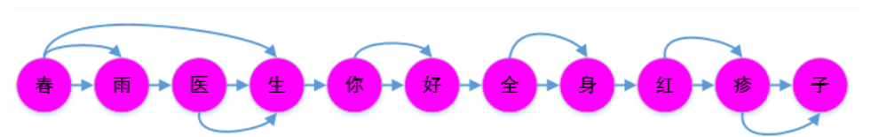

# jieba分词原理说明

主要是通过词典分词，若词语不在词典之中，使用HMM算法识别新词。具体流程为如下所示。

1. 初始化，加载词典文件，获取词语以及出现的次数
2. 切分短语，利用正则表达式，将文本切分为多个语句（句子），之后对语句进行分词
3. 构建DAG，通过字符串匹配，构建所有可能分词结果的有向无环图（DAG）
4. 构建节点最大路径概率以及结束位置，计算每个汉字节点到句尾结尾中所有路径中最大概率，并记录在最大概率的时候DAG中对应汉字成词的结束文字
5. 构建切分组合，根据节点路径，得到词语切分结果
6. 如果该词语不在词典中，运用统计方法HMM（隐马尔可夫模型）处理
7. 运用yield语句返回逐个返回分词结果

## 例子

运用有向无环图的查找算法，通过动态规划，使得词语的切割组合联合概率最大，下面以“春雨医生你好全身红疹子”为例子。

假设词语词典如下

| 词语             | 次数  | 词性 |
| :--------------: | ---- | :-------: |
| 医生 | 100  | n         |
|春雨|100|n|
| 春雨医生 | 100  | n    |
| 你好 | 100 | n |
| 全身 | 100  | n    |
| 红疹 | 100 | n |
| 疹子 | 100 | n |

无环有向图如下所示

# 参考

[jieba分词介绍](https://www.cnblogs.com/foley/p/12789634.html)
