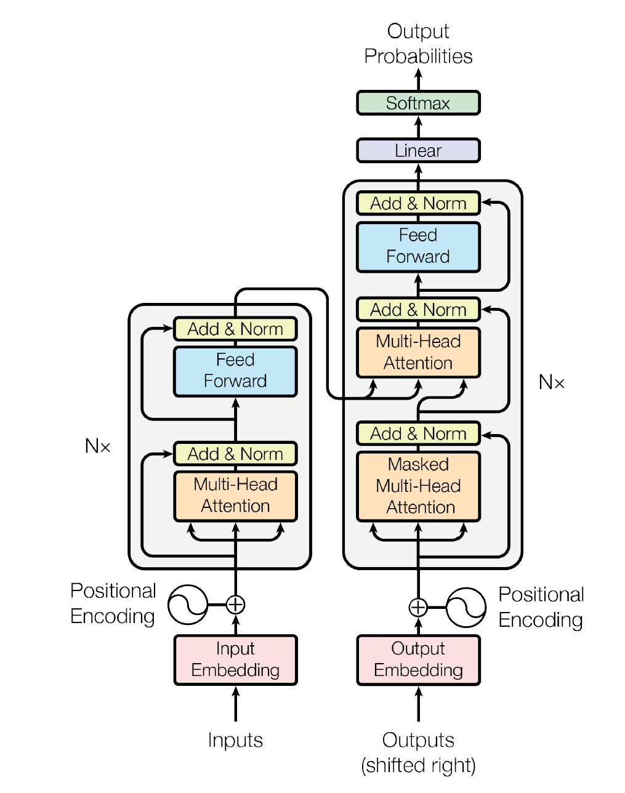
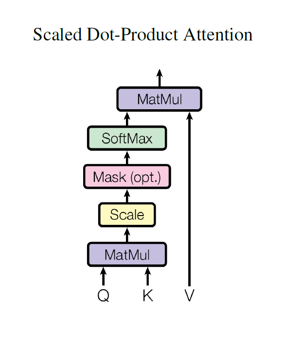
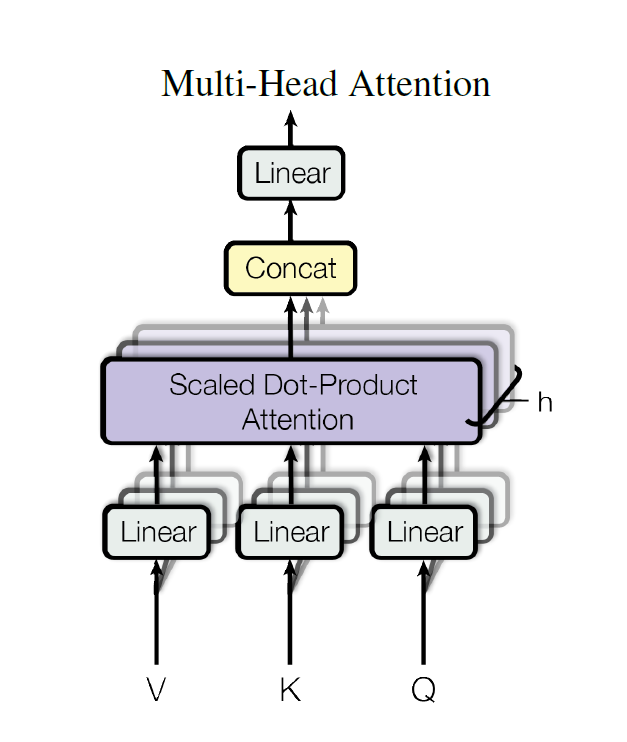
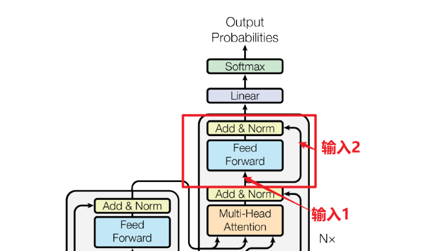

# 介绍

## 模型框架图示

- 

## 输入

- Transformer输入=单词Embedding + 单词位置Position Embedding
- 单词Embedding 一般来自于word2Vec等其他预训练模型得到，或者是PLMs自带的词典
- Position计算方式【正交余弦学习相对位置】
  - $PE_{(pos,2i)}=\sin{(pos/10000^{2i/d})}$
  - $PE_{(pos,2i+1)}=\cos{(pos/10000^{2i/d})}$
  - pos代表的是单词在句子中的位置，d为Embedding维度/PE维度【方便与word Embedding一起加减】
  - 2i+1代表词嵌入期数维度的时候，2i代表词嵌入维度为偶数维度的时候
- Position计算优势
  - 更加容易计算词嵌入相对位置，运用三角函数替换即可

## self-attention

- self-attention核心为Q（query），K（key），V（value）矩阵，在实操中，一般输入为单词的词嵌入矩阵（一行为一个单词表示）/上一个block的输出，Q,K,V是运用self-attention对输入线性变换得到。

### 步骤

- 对W（单词词嵌入表示矩阵）进行线性变换矩阵WQ，WK，WV，随后获得Q，K，V
- 得到Q，K，V后计算self-attention输出，attention计算公式如下所示
  - $\mathrm{Attention}(Q,K,V)=\mathrm{softmax}\left(\frac{QK^{T}}{\sqrt{d_{k}}}\right)V$
  - $\sqrt{d_k}$是Q矩阵和K矩阵的维度，为Q和K矩阵维度相同
  - 最终输出为$QK^T$为一个方阵

### 模型图示（scaled dot-product attention）

- 

## multi-head attention

- 多个self-attention组合，具体模型如下所示

### 步骤

- 输入为X（单词词嵌入表示），先将X输出到h个self-attention中，得到h个输出矩阵
- 将h个输出矩阵连接，得到一个与X矩阵维度\*h的矩阵
- 最终经过一个线性层，随后得到一个与X矩阵维度一致的矩阵

### 模型图示

- 

## add & norm

### Add

- 原理为残差连接，用与解决多层网络训练过程梯度消失、误差变大等问题，主要运用在multi-head attention和feedforward中，公式如下
  - $$\mathrm{LayerNorm}\big(X+\mathrm{MultiHeadAttention}(X)\big)$$
  - $\mathrm{LayerNorm}\big(X+\mathrm{FeedForward}(X)\big)$
- 主要体现为将网络输入与网络输出结合，为跳层结合，具体如下图所示
  - 

### norm

- 即为简单的将每一层神经元的输入转化为方差、均值一致（输入归一化处理），能够加快模型学习知识，从而加快收敛速度

## feed forward

- 构成为两个全连接层，此外，第一层为激活函数Relu，第二层不适用激活函数，此外，最终输出矩阵与输入维度一致
- 公式
  - $\mathrm{FFN}(x)=\max(0,xW_1+b_1)W_2+b_2$
  - x为输入，此外，max()为Relu函数

# 参考

- [Transformer模型详解（图解最完整版）](https://zhuanlan.zhihu.com/p/338817680)
- 参考论文：[Attention Is All You Need](https://arxiv.org/abs/1706.03762)