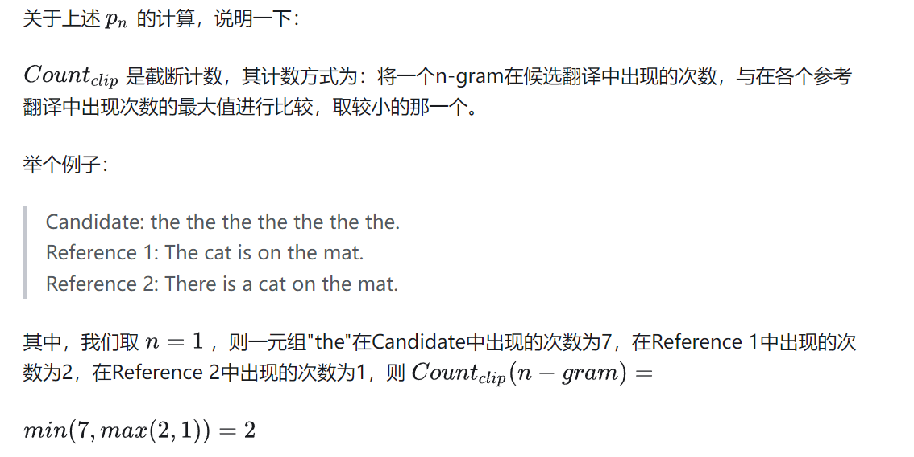
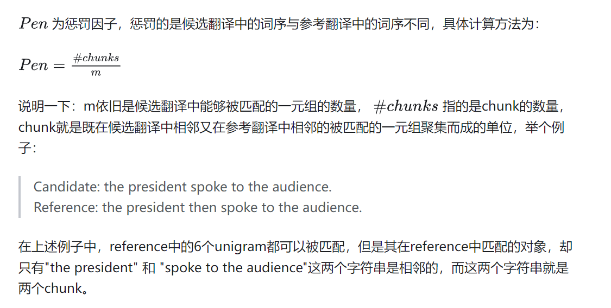

# ROUGE

- ROUGE 包括多个子指标，常用的是 ROUGE-N 和 ROUGE-L。
- ROUGE-N 中的“N”表示 N-gram，计算方式类似于 BLEU，但基于召回率。
  - $ROUGE-N=\frac{\sum_{S\in\{RefereneeSummaries\}}\sum_{gram_n\in S}Count_{match}(gram_n)}{\sum_{S\in\{ReferenceSummaries\}}\sum_{gram_n\in S}Count(gram_n)}$
  - 参数说明
    - $Count(gram_n)$为n-gram在给定参考的个数
    - $Count_{match}(gram_n)$为一起出现次数
- ROUGE-L 计算的是候选摘要与参考摘要的最长公共子序列长度，基于 F 值。
  - $ROUGE-L=\frac{(1+\beta^{2})R_{lcs}P_{lcs}}{R_{lcs}+\beta^{2}P_{lcs}}$
  - $R_{lcs}=\frac{LCS(X,Y)}{m}$
  - $P_{lcs}=\frac{LCS(X,Y)}{n}$
  - 参数说明
    - X为生成，Y为参考
    - LCS(X,Y)为生成和参考的最长公共子序列
    - m为参考的长度，n为生成的长度
- 主要特点：基于召回率，适用于文本摘要和图像描述。

# BLEU

- BLEU 是一种用于自动评估机器翻译或文本生成任务的指标。

- 它通过比较候选译文和参考译文中 n-gram 的重合程度来衡量译文质量。通常使用 unigram 衡量单词翻译的准确性，高阶 n-gram 衡量句子翻译的流畅性。

- 计算公式：

  - $BLEU=BP\cdot exp(\sum_{n=1}^Nw_nlogp_n)$
  - 其中，n 表示 n-gram，$w_n$表示 n-gram 的权重。
  - BP 是短句子惩罚因子（brevity penalty），用于解决短句得分较高的问题。
  - pn 表示 n-gram 的覆盖率，公式如下
    - $P_n=\frac{\sum_{C\in\{Candidates\}}\sum_{n-gram\in C}Count_{clip}(n-gram)}{\sum_{C^{\prime}\in\{Candidates\}}\sum_{n-gram\in C^{\prime}}Count(n-gram)}$
    - 计算例子
      - 
  - 主要特点：基于精确率，适用于机器翻译。
  - 缺点：只看重精确率，不考虑召回率。

# METEOR

- METEOR 是基于 BLEU 进行改进的指标，旨在解决 BLEU 中的一些固有缺陷。

- 它使用 WordNet 计算特定的序列匹配、同义词、词根和词缀，改善了 BLEU 的效果，使其与人工判别更相关。

- 计算公式：

  - $METEOR=(1-pen)\times F_{means}$
  - $F_{means}=\frac{PR}{\alpha P+(1-\alpha)R}$
  - $P=\frac{m}{c}，R=\frac mr$
  - P 和 R 分别是候选翻译和参考摘要的精确率和召回率，pen为惩罚因子
  - Pen计算方式
    - 
  - 主要特点：基于 F 值，考虑同义词、词干，适用于机器翻译和图像描述

# 参考

- [ROUGE, BLEU, METEOR参考](https://zhuanlan.zhihu.com/p/108630305)