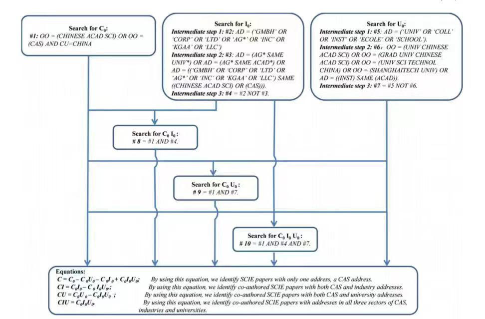

<!-- START doctoc generated TOC please keep comment here to allow auto update -->
<!-- DON'T EDIT THIS SECTION, INSTEAD RE-RUN doctoc TO UPDATE -->

- [会议DDL相关信息](#%E4%BC%9A%E8%AE%AEddl%E7%9B%B8%E5%85%B3%E4%BF%A1%E6%81%AF)
- [影响因子检索](#%E5%BD%B1%E5%93%8D%E5%9B%A0%E5%AD%90%E6%A3%80%E7%B4%A2)
- [检索文章会议](#%E6%A3%80%E7%B4%A2%E6%96%87%E7%AB%A0%E4%BC%9A%E8%AE%AE)
- [WOS高级检索方式](#wos%E9%AB%98%E7%BA%A7%E6%A3%80%E7%B4%A2%E6%96%B9%E5%BC%8F)

<!-- END doctoc generated TOC please keep comment here to allow auto update -->

# 会议DDL相关信息

- https://conferencelist.info/upcoming/

# 影响因子检索

- https://www.letpub.com.cn/index.php?page=journalapp

# 检索文章会议

- https://dblp.org/【这个检索还挺好用的】
- https://scholar.google.com/
- 各大会议期刊网站
- wos
- ACM数据库

# WOS高级检索方式

- 

# 文献节点参考显示图

- https://www.connectedpapers.com/